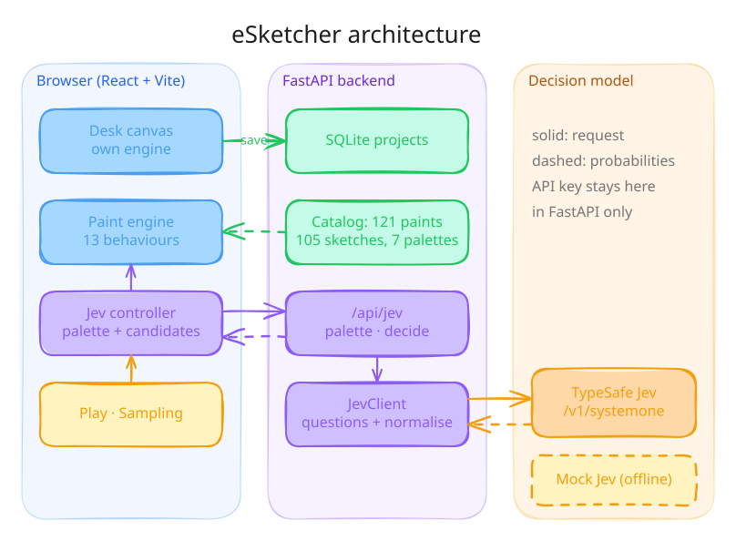
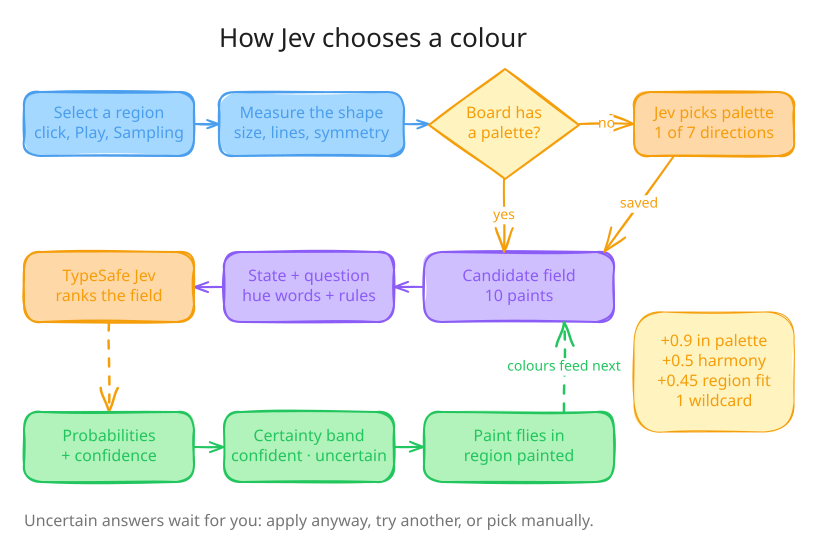
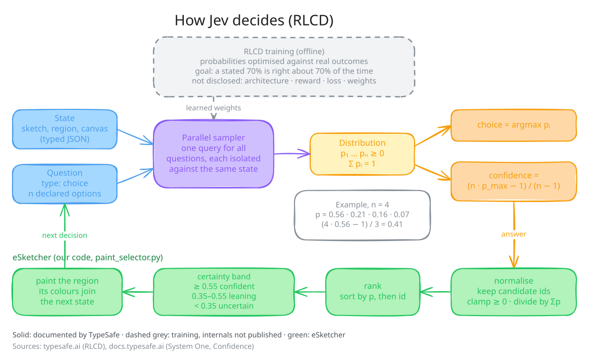
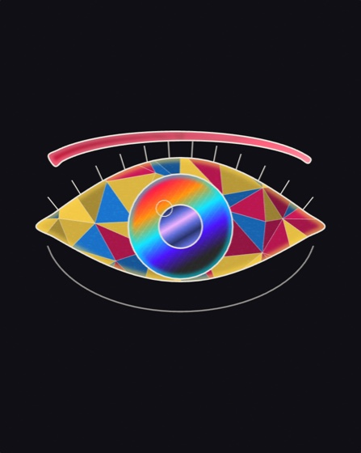
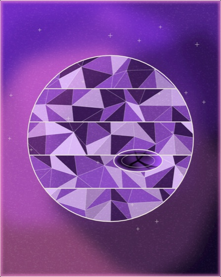
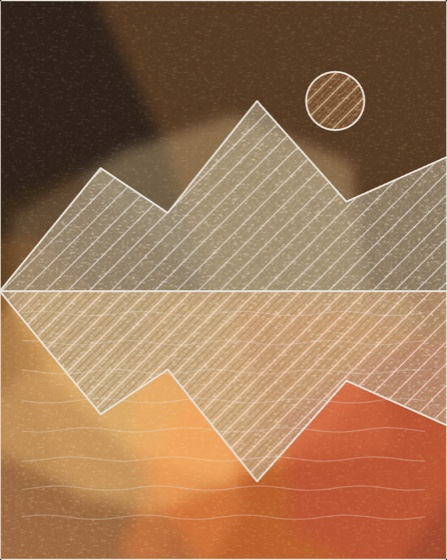
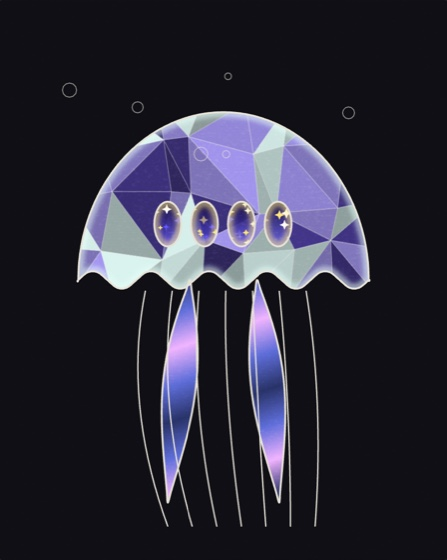
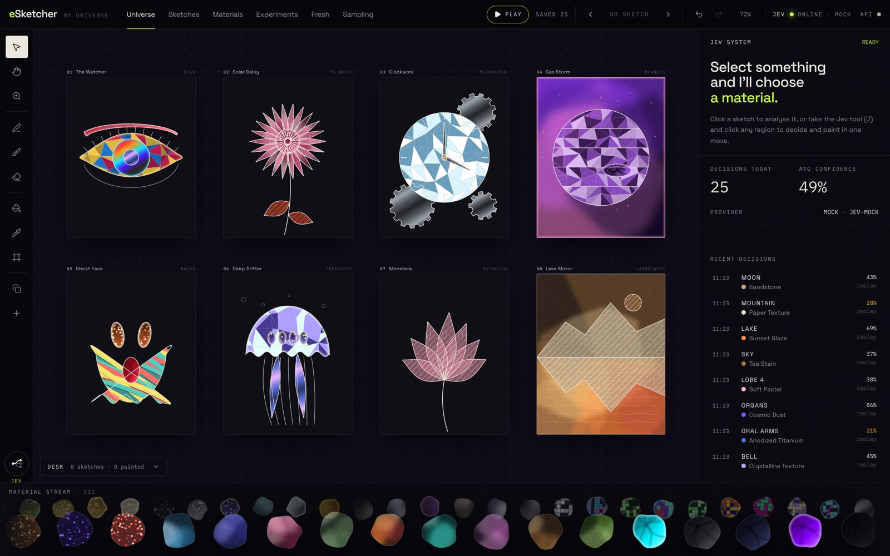

# eSketcher

A generative painting instrument. You select part of a sketch; **Jev** (TypeSafe's System One model) decides which paint material it should get; the material leaves the stream at the bottom of the screen, flies across the desk and paints itself in.

```
SKETCH → SELECT → JEV DECIDES → PAINT MATERIAL ARRIVES → CANVAS TRANSFORMS
```

<p align="center">
  
</p>

<p align="center">
  
</p>

<p align="center">
  
</p>

**Inside Jev.** TypeSafe publishes the behaviour, not the model. It documents these parts:
- Jev answers each question in one parallel-sampler query, isolated against the same state.
- Every answer is a probability distribution over the declared options.
- The choice is the most likely option.
- Confidence is `(n·p_max − 1)/(n − 1)`: 0 when all options are equally likely, 1 when one option has all the probability.
- RLCD (*Reinforcement Learning for Calibrated Decisions*) trains those probabilities against real outcomes so they are calibrated.

TypeSafe doesn't publish the architecture, reward, loss or weights, so the diagram shows those as a dashed box instead of inventing them.

### Painted by Jev

One Play run in mock mode: each board got a palette from Jev first, then one decision per region.

<p align="center">
  
  
  
  
</p>
<p align="center">
  
</p>

- 105 procedural line-art sketches across 21 categories, each with named, paintable regions (eye, iris, petal, gear…)
- 121 procedural paint materials across 13 behaviours, each with its own reveal animation (liquid blobs, spray particles, watercolor blooms, ink branching, chrome sweeps, pixel assembly, smoke, glitter orbits, lava, holographic foil, dry media, crystal facets, impasto strokes)
- An infinite desk (our own canvas engine, no licensed dependencies) with any number of sketch boards: pan, zoom, select, move, resize, rotate, duplicate, group, lock, delete, pen, brush, erase, frames, undo/redo
- **Play**: Jev fills every sketch on the desk, one decision per region kind, with the camera following each board
- **Sampling**: pick N samples; they line up in a carousel under a stage, and Play lifts each one onto the stage, paints it, drops it back and slides the carousel on
- Probability fields drawn from Jev's real distribution, with honest uncertainty
- Manual override everywhere: apply, try another, pick manually, lock material, lock sketch, undo
- Chaos mode, decision history with replay, autosave
- A home page at `/` (the logo always links there) and the studio at `/studio`; **Fresh** in the nav clears the desk to an empty canvas (undoable)
- Responsive from 360px phones (portrait and landscape) through tablets to desktop, with touch: pinch zoom, finger-sized handles, a decision pill on small screens

**Demo:** [esketcher.faiz-ai.dev](https://esketcher.faiz-ai.dev). When the server is down or not deployed, the site runs in [demo mode](#demo-mode-server-down). Everything works except Jev: sketches, materials, the canvas, manual painting, history, and saving in your browser. Play, Sampling's Play, the Jev tool and chaos are off, because there's nothing to answer them. [Run it locally](#quick-start) to see Jev decide.

Generated from the [codestash](../codestash) template (`python3 cli.py`), then cut down to what this app needs: no Postgres, Terraform, LangChain agent or vendored skills.

## Quick start

Requirements: Python 3.12+ with [uv](https://docs.astral.sh/uv/), Node 22+ with npm.

```bash
# backend: http://localhost:8000 (docs at /docs)
cd backend
cp .env.example .env          # JEV_MODE=mock works with no key
make install
make dev

# frontend: http://localhost:5173 (proxies /api to the backend)
cd frontend
cp .env.example .env
npm install
npm run dev
```

Other arena apps also use 8000 and 5173. To run side by side:

```bash
cd backend && uv run --extra dev uvicorn app.main:app --port 8010 --reload
cd frontend && PORT=5180 DEV_PROXY_TARGET=http://localhost:8010 npm run dev
```

With Docker, use `BACKEND_PORT=8010 FRONTEND_PORT=5180 docker compose up --build`. It runs the backend with SQLite in a named volume and the Vite dev server.

### Routes and hosting

`/` is the home page and `/studio` is the studio; routing uses the History API (`src/lib/router.ts`), and `src/lib/meta.ts` gives each route its own title, description and canonical URL. Opening the studio from the home page runs a paint wipe (`src/lib/transition.ts`); it is skipped under `prefers-reduced-motion`, as are the hero's flights, tilt and marquee. Vite's dev and preview servers already fall back to `index.html`. On any other static host, rewrite unknown paths to `index.html` so `/studio` works on refresh.

### Demo mode (server down)

On page load, the site asks the server for the catalog. If the server can't be reached, it switches to **demo mode** for that visit. "Can't be reached" covers a refused connection, an error status, no answer within 6 s, or a static host answering `/api` with its HTML page. In demo mode:

- **Catalog.** Materials, sketches and palettes come from `frontend/src/data/catalog.json`, loaded as a separate ~11 kB gzipped chunk only when needed. The backend generates this file with `make catalog`; `test_catalog.py` fails if it drifts from the API.
- **Saving.** The desk saves to `localStorage` in place of `/api/projects`.
- **Jev.** Every Jev call fails with code `offline`. The UI switches Jev off and says so; it never invents a decision. The Jev tool acts as the paint tool.

The mode is chosen once per visit and a reload tries the server again. If the server drops mid-visit, the canvas keeps working and Jev shows "connection interrupted". `npm run build:static` (`VITE_OFFLINE=1`) forces demo mode for a whole build, for hosts that will never have a backend.

`frontend/vercel.json` deploys the normal build:

- It rewrites every route except `/api/*` to `index.html`, so a missing backend returns a quick 404.
- It caches assets for a year.

To deploy on Vercel:

1. Import the repo.
2. Set **Root Directory** to `frontend`.
3. Add the domain `esketcher.faiz-ai.dev`.

When the backend is deployed, choose one:

- Add `{ "source": "/api/(.*)", "destination": "https://<backend>/api/$1" }` before the existing rewrite. This keeps requests on the same origin and needs no CORS.
- Or set `VITE_API_URL` in Vercel and add the site's origin to the backend's `CORS_ORIGINS`.

## Jev modes

| `JEV_MODE` | What answers | Needs |
|---|---|---|
| `mock` (default) | `MockJevProvider`: deterministic, local, same wire format as TypeSafe | nothing |
| `real` | `RealJevProvider`: `POST https://api.typesafe.ai/v1/systemone` | `TYPESAFE_API_KEY` |

The UI behaves identically in both modes. The header shows which one is live (`JEV ● ONLINE · REAL`), and each decision shows the model that produced it (for example `jev-1.13.0`).

**Mock mode** scores each candidate from the same traits real Jev receives: region kind, measured complexity, density, symmetry, area, painted neighbours, and chaos. It adds seeded noise and a softmax whose temperature varies per target. Some answers are decisive and some are genuinely uncertain, and it doesn't always pick the first candidate. Its confidence uses the formula TypeSafe documents for real Jev: `(n·p_max − 1)/(n − 1)`.

**Real mode:** put the key in `backend/.env` and set `JEV_MODE=real`. The backend refuses to start in real mode without a key. The key never reaches the browser, and it never appears in logs.

### Environment variables

`backend/.env`:

| Variable | Default | Purpose |
|---|---|---|
| `JEV_MODE` | `mock` | `mock` or `real` |
| `TYPESAFE_API_KEY` | — | TypeSafe bearer token (real mode) |
| `TYPESAFE_BASE_URL` | `https://api.typesafe.ai` | API host |
| `JEV_MODEL` | `jev-latest` | Any name from `GET /v1/models` (`jev-latest`, `jev-preview`) |
| `JEV_TIMEOUT_SECONDS` | `8` | Per-request timeout; one retry on 5xx, 429 or network errors |
| `JEV_RATE_LIMIT_PER_MINUTE` | `60` | Jev decisions per client per minute |
| `JEV_DAILY_LIMIT_PER_CLIENT` | `600` | Jev decisions per client per UTC day (`0` = off) |
| `JEV_DAILY_BUDGET` | `5000` | Paid Jev decisions for the whole server per UTC day (`0` = off) |
| `RATE_LIMIT_PER_MINUTE` | `300` | Every `/api` request, per client |
| `PROJECT_WRITES_PER_MINUTE` | `60` | Project creates and saves, per client |
| `MAX_PROJECT_BYTES` | `1000000` | Largest request body; bodies must send `Content-Length` |
| `DATABASE_URL` | `sqlite+aiosqlite:///./esketcher.db` | Project storage (any async SQLAlchemy URL) |
| `CORS_ORIGINS` | `http://localhost:5173` | Comma-separated; only needed when the frontend isn't proxied |
| `ENV` | `development` | `production` disables `/docs` |

`frontend/.env`:

| Variable | Purpose |
|---|---|
| `DEV_PROXY_TARGET` | Where the Vite dev server forwards `/api` |
| `VITE_API_URL` | Backend URL for production builds |
| `VITE_OFFLINE` | `1` forces demo mode for the whole build (`npm run build:static`); otherwise demo mode starts only when the server is down |

### VM deployment

The `Deploy to VM` GitHub Actions workflow deploys the backend and Postgres to the VM on every push to `main` (or manually from the Actions tab). The frontend is deployed separately on Vercel.

Configure these GitHub repository secrets:

| Secret | Required | Purpose |
|---|---|---|
| `DEPLOY_HOST` | yes | VM hostname or IP |
| `SSH_PRIVATE_KEY` | yes | Private key whose public key is in the VM user's `~/.ssh/authorized_keys` |
| `POSTGRES_PASSWORD` | yes | Database password |
| `DEPLOY_SSH_USER` | no | VM SSH user; defaults to `gigan` |
| `DEPLOY_SSH_PORT` | no | SSH port; defaults to `22` |
| `DEPLOY_PATH` | no | Deployment directory; defaults to `/opt/esketcher` |
| `API_DOMAIN` | no | Public API hostname; defaults to `api.esketcher.faiz-ai.dev` |
| `LETSENCRYPT_EMAIL` | no | Renewal notices; if omitted, Certbot uses no-email registration |
| `CORS_ORIGINS` | no | Defaults to `https://esketcher.faiz-ai.dev` |
| `JEV_MODE` | no | `mock` by default; set to `real` to use TypeSafe |
| `TYPESAFE_API_KEY` | only for real mode | TypeSafe API key; add it as a GitHub secret, never commit it |
| `TYPESAFE_BASE_URL` | no | Defaults to `https://api.typesafe.ai` |
| `JEV_MODEL` | no | Defaults to `jev-latest` |
| `JEV_TIMEOUT_SECONDS` | no | Defaults to `8` |
| `JEV_RATE_LIMIT_PER_MINUTE` | no | Defaults to `60` |
| `JEV_DAILY_LIMIT_PER_CLIENT` | no | Defaults to `600` |
| `JEV_DAILY_BUDGET` | no | Defaults to `5000`; the cost ceiling for real mode |
| `RATE_LIMIT_PER_MINUTE` | no | Defaults to `300` |
| `PROJECT_WRITES_PER_MINUTE` | no | Defaults to `60` |
| `MAX_PROJECT_BYTES` | no | Defaults to `1000000` |
| `POSTGRES_DB` | no | Defaults to `esketcher` |
| `POSTGRES_USER` | no | Defaults to `esketcher` |
| `BACKEND_PORT` | no | VM loopback port; defaults to `8010` |

### Abuse limits

The public API has no login, so it is protected in layers. Each layer counts only what the one before it let through: a client blocked per minute can't use up the shared budget.

| Layer | Limit | Refusal |
|---|---|---|
| nginx on the VM | 5 req/s per IP (burst 40), 20 connections, 1 MB bodies | `429` / `413` |
| Every `/api` request | 300 per IP per minute | `429 rate_limited` |
| Request bodies | must send `Content-Length`, at most `MAX_PROJECT_BYTES` | `411` / `413` |
| Project creates and saves | 60 per IP per minute | `429 rate_limited` |
| Jev decisions | 60 per IP per minute | `429 rate_limited` |
| Jev decisions | 600 per IP per UTC day | `429 daily_limit` |
| Jev decisions | 5,000 for the whole server per UTC day | `429 jev_budget` |

Every refusal includes `Retry-After` and CORS headers, so the studio shows a clear message instead of a network error. Payload sizes are already bounded: at most 16 candidates per decision, and short labels.

Two conditions keep the per-IP limits honest:

- **Real client IPs.** nginx overwrites `X-Forwarded-For` with `$remote_addr`, and the backend trusts that header (`FORWARDED_ALLOW_IPS=*` in `docker-compose.prod.yml`). That trust is safe only because the container port is bound to the VM's loopback. If Cloudflare's proxy sits in front, `$remote_addr` is Cloudflare's address; switch nginx to `real_ip_header CF-Connecting-IP` with Cloudflare's IP ranges.
- **One process.** The counters are held in memory. That fits the single-container deploy. A restart resets them, so also set a spend limit in the TypeSafe dashboard: it is the only ceiling a restart can't reset.

CORS limits which websites can call the API from a browser; it doesn't stop scripts. The limits above do.

In Vercel, set `VITE_API_URL` to the public backend URL, for example `https://api.esketcher.faiz-ai.dev`, and point that hostname's reverse proxy to `127.0.0.1:8010` on the VM. The backend CORS origin must include `https://esketcher.faiz-ai.dev`.

## How a decision works

A finite, described candidate set goes to Jev, and Jev returns a probability distribution. Everything around that distribution is deterministic code.

```
React ──► FastAPI ──► TypeSafe Jev ──► probability distribution ──► FastAPI ──► React ──► paint
```

1. **Select.** Click a board (select tool), or click a region with the Jev tool (`J`).
2. **Measure.** `frontend/src/lib/analysis/analyzer.ts` measures the real geometry of the selection: area ratio, ink density relative to the sketch, mirror symmetry, and composition.
3. **Palette.** On a board's first decision, Jev picks a palette direction for the whole sketch, such as *neon night*, *sunset fire*, *ocean & ice* or *royal jewel* (`POST /api/jev/palette`). It's stored on the board, and every later region follows it.
4. **Candidates.** `lib/jev/candidates.ts` builds the field (10 by default, 14 in chaos, at most 2 per behaviour):
   - mostly materials from the board's palette that harmonise with what's already painted (analogous or complementary hues)
   - luminous options for focal regions and calmer ones for large backgrounds
   - one contrasting wildcard, plus anything you pinned
5. **Ask.** `POST /api/jev/decide`. The backend validates ids against its catalog and builds two things:
   - a `state`: the sketch, the target in words and numbers, the painted colours in words, and the palette direction
   - a `choice` question: each candidate is described with its named hues, warm/cool temperature and traits, and the instructions spell out the harmony rules. Whole-sketch selections add a second `choice` question for the **treatment**: `focal-accent`, `full-flood`, `duotone` or `spectrum-mix`.
6. **Normalise.** `services/paint_selector.py` restricts Jev's probabilities to the candidates, fills any gaps, renormalises, and ranks them. Jev's own `confidence` sets the band: `confident` ≥ 0.55, `uncertain` < 0.35, `leaning` between.
7. **Show.** The panel draws the full field, the confidence needle and the treatment.
8. **Paint.** With the Jev tool, a `leaning` or better answer paints automatically (configurable under Experiments). An `uncertain` field waits for you: *Apply anyway*, *Try another*, or *Pick manually*. The material flies from its chip in the stream to the region, lands, and the reveal plays.

### Colour quality

Colour is decided at three levels: a palette per board, a harmony-aware candidate field, and colour words and rules in what Jev reads.

I measured the effect by painting the same four sketches with real Jev before and after. The scores are area-weighted: a colour pair counts as harmonious if the hues are analogous (≤ 40° apart), triadic or complementary.

| | before | after |
|---|---|---|
| harmonious colour pairs | 0.65 | **0.94** |
| hue families per board | 1.75 | **1.50** |
| worst board (Skyline 3AM) | 0.00 | **0.90** |

The mock provider follows the same palette and harmony rules, so mock mode looks coherent too.

### Play

**Play** in the header runs the whole loop across the desk. For every unlocked board, it groups the unpainted regions by kind (all petals, all windows), asks Jev once per group, and flies the winner into every region of that group. The camera glides to each board, and the panel shows each field as it resolves. Uncertain answers are applied anyway, because the point is to fill the desk, but the panel still shows them as uncertain.

*Pause* finishes the current decision and holds; *Resume* continues from there, and *Stop* abandons the run. If the desk is already full, Play repaints it. A 12-board desk takes about 37 decisions, which is roughly 70k input tokens in real mode.

### Sampling

**Sampling** (beside Fresh) sets how many samples to run (3–30, or presets of 4, 7, 12 or 24) and which sketches (mixed, or one category). **Build carousel** replaces the desk with the samples in a row under a stage. It's one undo step, so ⌘Z brings the old desk back.

With a carousel built, **Play** drives it. The centre sample pops and flies up to the stage, and Jev paints it: one real decision per region kind, with the paint flying in from the stream. Then the sample drops back into its slot, and the carousel slides one step, so painted samples drift off to the left and the next one arrives in the centre. After the last sample, the carousel whips back through every painted one and settles.

- *Pause* holds between samples. *Rewind* returns to the first sample. *Dissolve* keeps the painted boards as ordinary desk boards.
- Playing a finished carousel again repaints it.
- Editing is paused while it runs (panning still works).
- It's all on the real desk, so the results autosave.

The layout and choreography live in `src/state/sampling.ts`, the tweening in `src/lib/desk/animate.ts`, and the stage, carousel and arrow drawing in `src/components/Canvas/SamplingDecor.tsx`. With `prefers-reduced-motion`, every move is instant.

*Try another* calls `POST /api/jev/retry` with the rejected winner removed, and tells Jev which materials were rejected. **Lock material** makes a sketch always paint with one material without asking Jev. **Lock sketch** freezes a board. Every paint is a single undo step.

The backend's `JevClient` exposes `decide_paint`, `rank_paint_candidates`, `decide_sketch_treatment` and `get_health`. `get_health` checks `GET /v1/models` and caches the result for 30 s.

## Architecture

Both diagrams are at the top of this README. Their editable sources are [`docs/architecture.excalidraw`](docs/architecture.excalidraw) and [`docs/color-decision.excalidraw`](docs/color-decision.excalidraw); open them at excalidraw.com.

```
backend/app/
  main.py                 app factory: CORS, request-id + JSON logs, routers
  config.py               pydantic-settings; real mode requires a key
  catalog/                materials.py (121) · sketches.py (105) · palettes.py (7): source of truth
  models/                 camelCase wire schemas with strict validation
  routes/                 health · sketches · materials · decisions · projects
  services/
    jev.py                JevProvider → Real / Mock, JevClient, error taxonomy
    paint_selector.py     question building, normalisation, ranking, certainty
    color.py              hex → hue words, warm/cool, harmony
    sketch_analyzer.py    features → Jev state
    projects.py           SQLite/SQLAlchemy project store with revision guard
  rate_limit.py           sliding-window limiter for /api/jev/*

frontend/src/
  components/             Header · Toolbar · Canvas · MaterialRail · JevPanel ·
                          JevDecision (probability field, thinking, flights) · SketchGallery
  lib/sketchArt/          ArtBuilder + 21 category generators (procedural line art)
  lib/paintEngine/        PaintLayer (13 behaviours) · recipes · swatches · shared SVG defs
  lib/desk/               the canvas engine: Desk (document, history, camera, hit-testing),
                          GestureController (pointer/keyboard state machine), strokes
  lib/canvas/             sketch boards on the desk: art, coordinates, paints, seeding
  lib/analysis, lib/jev   selection measurement · candidate field · treatment distribution
  state/                  zustand UI store · jevController (the decision loop) · simulation (Play)
  hooks/                  catalog, health, project sync, chaos, decision
  services/api.ts         typed client that keeps backend error codes
```

Canvas state (boards, paints, strokes, frames) lives in the `Desk` document and is autosaved to `/api/projects/{id}` as `{ desk: DeskDoc }`. UI state (focus, active decision, flights, history, simulation) lives in zustand. Keeping the two apart means a Jev decision never re-renders the canvas.

**Why our own canvas.** tldraw v5 requires a paid licence for production: without one it watermarks the canvas and hides it after 5 seconds on non-localhost hosts. eSketcher only needed its camera, selection, transforms, drawing and history, and those fit in about 1,000 lines we own. The engine is pure TypeScript over a vanilla zustand store. Screen space is client coordinates, and `screen = (page + camera) · zoom + viewport`. Every mutation is one undo step, except a gesture (drag, resize, rotate), which folds into a single step. Only shapes that intersect the viewport render. Pen strokes use [perfect-freehand](https://github.com/steveruizok/perfect-freehand) (MIT).

Performance choices:
- The home page paints before any script runs (a static wordmark in `index.html`) and renders its hero without waiting for the catalog. Its artwork (`src/components/Home/HomeArt.tsx`: the self-painting stage and the material grid) is the only part that needs the sketch generators and paint engine, so it is a lazy chunk that lands after the hero text.
- The studio is a separate chunk (`src/components/Studio.tsx`, lazy-loaded), so the home page never downloads the desk engine. `main.tsx` starts that download at once on `/studio`, or once idle from the home page.
- The two fonts the first screen needs are preloaded. When `VITE_API_URL` is set, production builds also preconnect to the API origin and preload the three catalog requests (`vite.config.ts`). Catalog GETs carry no `Content-Type`, so they need no CORS preflight.
- Only shapes intersecting the viewport render, and the camera moves one CSS transform.
- Line art is generated once per recipe and memoised.
- The material stream moves by writing transforms from a `requestAnimationFrame` loop and re-renders only when its window of chips shifts.
- Galleries are windowed.
- Paint noise comes from one shared tile, not a filter per region.
- Reveal animations play only for fresh paints.
- Jev requests are cancellable and cached for 5 minutes per identical question.

### API

| Method | Path | |
|---|---|---|
| GET | `/api/health` | server version + Jev mode/model/online/latency |
| GET | `/api/sketches`, `/api/sketches/{id}` | `?category=` filter |
| GET | `/api/materials`, `/api/materials/{id}` | |
| GET | `/api/materials/palettes` | the 7 palette directions |
| POST | `/api/jev/palette` | `{target, context}` → `{palette, probabilities, confidence, certainty, …}` |
| POST | `/api/jev/decide` | `{target, context, candidateMaterials, scope}` → `{selectedMaterial, probabilities, ranking, confidence, certainty, treatment, latencyMs, provider, model, usage}` |
| POST | `/api/jev/retry` | as above + `rejectedMaterialIds`, `attempt` |
| POST / GET / PUT | `/api/projects`, `/api/projects/{id}` | snapshot storage; `PUT` takes `revision`, returns 409 on stale writes |

Errors use `{"detail": {"code", "message"}}`, and the UI maps each code to native copy. For example `jev_unavailable` shows *JEV CONNECTION INTERRUPTED* with *Retry* / *Continue manually*. The other codes are `jev_timeout`, `jev_auth`, `jev_quota`, `jev_malformed`, `rate_limited` and `bad_candidates`. A Jev failure never blocks painting by hand.

## Testing

```bash
cd backend && make lint test        # ruff + pytest, 90% gate (currently 100%)
cd frontend && npm run lint && npm run typecheck && npm run coverage   # 90% line gate (currently ~97%)
```

The backend tests use the mock provider and `httpx.MockTransport` for TypeSafe, so no network or key is needed.

The frontend gate covers everything except the stream's animation loop and the flight overlay, which are motion-driven and were verified by driving the app in Chrome. The canvas engine, gesture controller, simulation and canvas component are all in the gate.

## Keyboard

`V` select · `H` pan (or hold space, or middle-drag) · `Z` zoom · `D` pen · `⇧D` brush · `E` erase · `B` paint the armed material · `I` pick a material from a painted region · `F` frame · `J` Jev
`⌘Z` / `⇧⌘Z` undo / redo · `⌘D` duplicate · `⌘G` / `⇧⌘G` group / ungroup · `⌘A` select all · `⌫` delete · arrows nudge (`⇧` ×10) · `⇧L` lock · `]` / `[` front / back · `⇧1` zoom to fit · `⇧2` zoom to selection · `⌘0` 100% · `⌘`/pinch + wheel zooms, wheel pans. Double-click a board to fly to it; right-click for the context menu.